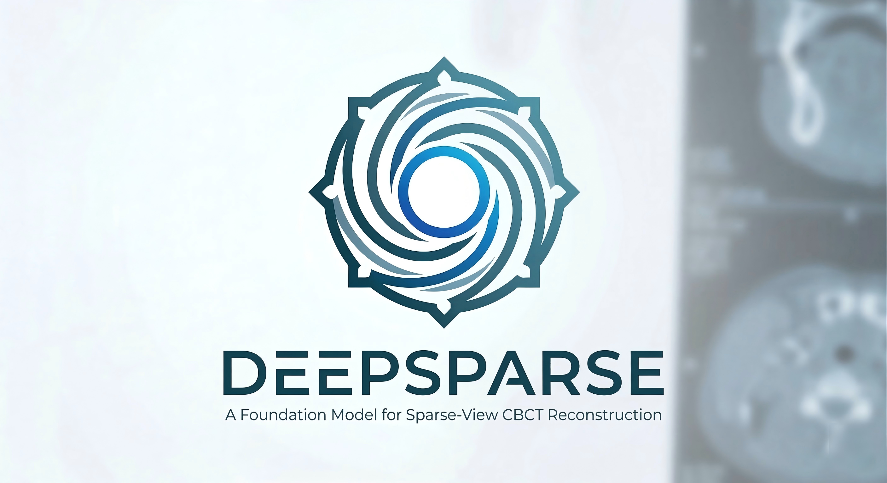

<div align=center>

<h1>DeepSparse: A Foundation Model for Sparse-View CBCT Reconstruction</h1>
</div>

<div align=center>
<a href="https://ieeexplore.ieee.org/document/11436116">

</a>
<a href="https://xmengli.github.io/">

</a>
</div>

<br>

This repository contains the official implementation of **[DeepSparse: A Foundation Model for Sparse-View CBCT Reconstruction](https://ieeexplore.ieee.org/document/11436116/)**, accepted in *IEEE Transactions on Medical Imaging* (TMI), 2026.

For any questions regarding this repository, please contact [jchenhu@connect.ust.hk](mailto:jchenhu@connect.ust.hk).

## :rocket: Updates

- The code for pretraining, finetuning, and evaluation is released.
- Pretrained and finetuned model weights are released on [HuggingFace](https://huggingface.co/HajihajihaJimmy/DeepSparse).

## :star: Highlights

- **Foundation model for sparse-view CBCT**: DeepSparse is pretrained on a large-scale abdominal CT dataset (AtlasAbdomenMini, ~7k volumes) and can be finetuned to diverse anatomical targets with few labelled examples.
- **Implicit neural representation with vector quantization**: A codebook-based encoder-decoder reconstructs 3D volumes from sparse 2D X-ray projections, enabling memory-efficient inference at arbitrary resolution.
- **Two-stage finetuning**: Stage 1 adapts the pretrained backbone to a target anatomy; Stage 2 refines the fine detail decoder with a frozen encoder, enabling high-quality reconstruction with as few as 6 views.
- **Generalizes across anatomies**: Evaluated on abdomen (PANORAMA), pelvis (PENGWIN), lung (LUNA16), and tooth (ToothFairy) with consistent state-of-the-art performance.

## :hammer: Environment

```bash
git clone https://github.com/xmed-lab/DeepSparse.git
cd DeepSparse
conda create -n deepsparse python=3.9
conda activate deepsparse
# PyTorch 1.13.1 + CUDA 11.6
conda install pytorch==1.13.1 torchvision==0.14.1 torchaudio==0.13.1 pytorch-cuda=11.6 -c pytorch -c nvidia
# Other dependencies
pip install SimpleITK scipy numpy einops tqdm matplotlib pytorch-lightning timm
# TIGRE (cone-beam CT projector) — follow the instructions at:
# https://github.com/CERN/TIGRE
```

## :computer: Prepare Dataset

All dataset preprocessing scripts are in `data/`. See [`data/README.md`](data/README.md) for the full directory structure and shared utilities.

Each dataset has its own subfolder with a `README.md`:

| Dataset | Anatomy | Folder |
|---------|---------|--------|
| [AbdomenAtlas1.0Mini](https://huggingface.co/datasets/AbdomenAtlas/AbdomenAtlas1.0Mini) | Abdomen (pretraining) | `data/atlas-mini/` |
| [PANORAMA](https://panorama.grand-challenge.org/) | Abdomen (finetuning) | `data/PANORAMA/` |
| [PENGWIN](https://pengwin.grand-challenge.org/) | Pelvis (finetuning) | `data/PENGWIN/` |
| [LUNA16](https://luna16.grand-challenge.org/) | Lung (finetuning) | `data/LUNA16_v2/` |
| [ToothFairy](https://toothfairy.grand-challenge.org/) | Tooth (finetuning) | `data/ToothFairy/` |

## :key: Training & Evaluation

> **Tip**: You can skip training entirely and download pretrained weights for direct inference — see [Download Checkpoints](#inbox_tray-download-checkpoints) below.

### Pretraining

```bash
bash scripts/pretrain.sh
```

Trains the foundation model on AtlasAbdomenMini for 800 epochs. The checkpoint used for finetuning is saved at `logs/pretrain/ep_700.pth`.

### Finetuning — Stage 1

```bash
bash scripts/finetune_s1.sh
```

Adapts the pretrained backbone to each downstream anatomy (abdomen, pelvis, lung, tooth) across three sparsity regimes (6, 8, 10 views). Checkpoints are saved under `logs/{dataset}+{n_view}v+s1/`.

For thorax fast,we specially draft **finetune_thorax_s1.sh** for thorax fast finetuning on stage 1, **finetune_thorax_s2.sh** is the same case.

### Finetuning — Stage 2

```bash
bash scripts/finetune_s2.sh
```

Refines with a frozen encoder to sharpen reconstruction quality. Loads Stage 1 checkpoints and saves results under `logs/{dataset}+{n_view}v+s2/`.

### Evaluation

```bash
bash scripts/evaluate_s2.sh
```

Runs evaluation on all datasets and view counts using Stage 2 checkpoints at `logs/{dataset}+{n_view}v+s2/ep_400.pth`.

## :inbox_tray: Download Checkpoints

Pretrained and finetuned checkpoints are hosted on HuggingFace and can be downloaded for direct inference:

**[HuggingFace — HajihajihaJimmy/DeepSparse](https://huggingface.co/HajihajihaJimmy/DeepSparse)**

Place the downloaded `logs/` folder in the project root. See [`logs/README.md`](logs/README.md) for a description of each checkpoint.

To download with `huggingface-cli`:

```bash
pip install huggingface-hub hf-transfer
HF_HUB_ENABLE_HF_TRANSFER=1 huggingface-cli download HajihajihaJimmy/DeepSparse --local-dir ./logs
```

## :blue_book: Citation

If you find this work helpful, please cite:

```bibtex
@ARTICLE{11436116,
  author={Lin, Yiqun and Chen, Jixiang and Wang, Hualiang and Yang, Jiewen and Guo, Jiarong and Zhang, Yi and Li, Xiaomeng},
  journal={IEEE Transactions on Medical Imaging},
  title={DeepSparse: A Foundation Model for Sparse-View CBCT Reconstruction},
  year={2026},
  volume={},
  number={},
  pages={1-1},
  doi={10.1109/TMI.2026.3674948}
}
```

## :beers: Acknowledgements

We thank the challenge organizers of PANORAMA, PENGWIN, LUNA16, and ToothFairy for making their datasets publicly available.
