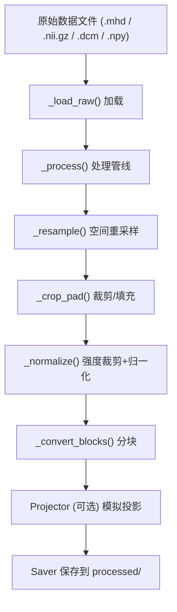
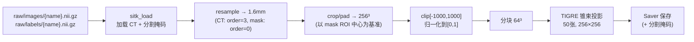
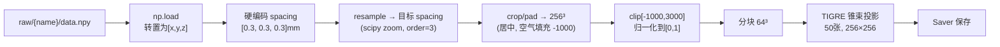
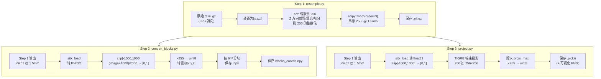
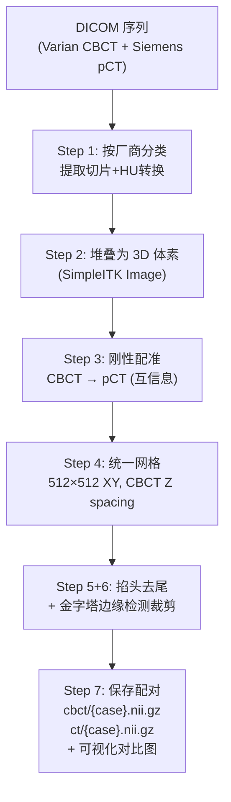

# DeepSparse 数据处理管线全览

本文档详细描述 DeepSparse 项目中所有数据集的处理流程，包括公共基类管线及各数据集的专有处理逻辑。

---

## 目录

1. [公共数据处理管线（`base/`）](#1-公共数据处理管线base)
   - [1.1 `base/utils.py` — SimpleITK 读写工具](#11-baseutilspy--simpleitk-读写工具)
   - [1.2 `base/dataset.py` — 核心 Dataset 基类](#12-basedatasetpy--核心-dataset-基类)
   - [1.3 `base/projector.py` — TIGRE 锥束投影模拟](#13-baseprojectorpy--tigre-锥束投影模拟)
   - [1.4 `base/saver.py` — 处理后数据保存](#14-basesaverpy--处理后数据保存)
2. [各数据集处理管线](#2-各数据集处理管线)
   - [2.1 LUNA16_v2（肺结节 CT）](#21-luna16_v2肺结节-ct)
   - [2.2 PANORAMA（腹部 CT + 分割掩码）](#22-panorama腹部-ct--分割掩码)
   - [2.3 PENGWIN（骨盆 CT + 分割掩码）](#23-pengwin骨盆-ct--分割掩码)
   - [2.4 Thorax Fast（胸部 CBCT DICOM）](#24-thorax-fast胸部-cbct-dicom)
   - [2.5 ToothFairy（牙齿 CBCT）](#25-toothfairy牙齿-cbct)
   - [2.6 atlas-mini（预训练数据集）](#26-atlas-mini预训练数据集)
   - [2.7 paired（配对 CT/CBCT 投影数据）](#27-paired配对-ctcbct-投影数据)

---

## 1. 公共数据处理管线（`base/`）

所有数据集（LUNA16_v2、PANORAMA、PENGWIN、Thorax Fast、ToothFairy）均继承自 `base/dataset.py` 中的 `Dataset` 基类，共享同一套核心处理管线。各数据集只需实现自己的 `__init__`（构建数据列表）以及可选的 `_load_raw`（自定义数据加载方式），其余处理逻辑完全复用基类。

### 整体流程



---

### 1.1 `base/utils.py` — SimpleITK 读写工具

**职责**：封装 SimpleITK 的体素数据读写，提供统一的加载/保存接口。

| 函数 | 功能 |
|------|------|
| `sitk_load(path, uint8, spacing_unit, image_type)` | 读取医学图像（.mhd/.nii.gz 等），返回 `(image, spacing, origin)`。若 `uint8=True`，自动将 `[0,255]` 除以 255 归一化到 `[0,1]`。默认输出 `float32`，轴序为 `[x, y, z]` |
| `sitk_save(path, image, spacing, origin, uint8)` | 保存医学图像。若 `uint8=True`，自动将 `[0,1]` 乘以 255 转为 `uint8` |
| `check_range(dataset)` | 辅助函数，遍历数据集统计图像尺寸范围（用于调参） |

---

### 1.2 `base/dataset.py` — 核心 Dataset 基类

**职责**：定义所有数据集的通用处理管线。子类继承后自动获得完整的 `resample → crop/pad → normalize → blocks` 流程。

#### 关键属性（由各 `config.yaml` 指定）

| 属性 | 含义 | 示例值 |
|------|------|--------|
| `_spacing` | 目标体素间距 (mm) | `[1.6, 1.6, 1.6]` |
| `_resolution` | 目标分辨率 (voxels) | `[256, 256, 256]` |
| `_value_range` | 强度裁剪范围 (HU) | `[-1000, 1000]` |
| `_block_size` | 分块大小 | `[64, 64, 64]` |
| `_process_mask` | 是否处理分割掩码 | `True`/`False` |
| `_projector` | 可选的投影模拟器 | `Projector` 实例 |

#### 核心方法

**`_load_raw(data)`**（可被子类覆盖）
- 默认实现：通过 `sitk_load` 读取 `.mhd`/`.nii.gz` 文件
- 若 `_process_mask=True`，同时加载 `mask_path` 指向的分割掩码
- 返回 `{'name', 'image', 'mask', 'spacing'}`

**`_process(data)`**
```
data → _resample → _crop_pad → _normalize
```

**`_resample(data)`**
- 使用 `scipy.ndimage.zoom` 按 `spacing_ratio = data['spacing'] / self._spacing` 重采样
- 图像：`order=3`（三次样条插值），`prefilter=False`
- 掩码（如果启用）：`order=0`（最近邻插值）
- 更新 `data['spacing']` 为目标 spacing

**`_crop_pad(data)`**
- 将图像统一到 `_resolution` 尺寸
- 若图像某维度 > 目标分辨率：**居中裁剪**
- 若图像某维度 < 目标分辨率：**边缘填充**，填充值为 `_value_range[0]`（即 min_value，通常为 -1000 HU 空气）
- 若 `_process_mask=True`：裁剪/填充以分割掩码 ROI 中心为基准（而非几何中心），确保目标区域居中
- 同时生成 `data['origin']`，记录处理后 CT 与原始 CT 注释之间的空间偏移

**`_normalize(data)`**
- **强度裁剪**：`np.clip(image, min_value, max_value)`
- **归一化到 [0,1]**：`(image - min_value) / (max_value - min_value)`
- `min_value` 和 `max_value` 来自 `config.yaml` 的 `value_range`

**`_convert_blocks(data)`**
- 将 `256³` 的体素按 `_block_size`（通常 `64³`）划分为规则网格块
- 生成 `blocks_vals`（各块的像素值列表）和 `blocks_coords`（归一化坐标 [0,1]）
- block 坐标公式：`coords = block_indices * offsets / (resolution - 1)`

**`__getitem__(index)`**
1. `_load_raw` → 加载原始数据
2. 若 `_return_raw=False`：
   - `_process` → 完整处理管线
   - `_convert_blocks` → 分块
   - 若 `_projector` 已初始化 → 模拟投影并附加 `projs` 和 `angles`

---

### 1.3 `base/projector.py` — TIGRE 锥束投影模拟

**职责**：从 3D CT 体素生成模拟的 2D X 射线投影。

| 类/函数 | 功能 |
|------|------|
| `ConeGeometry_special` | 继承 TIGRE 的 `Geometry`，封装锥束 CT 几何参数（DSD、DSO、探测器尺寸、体素尺寸、偏移等），单位统一为米 |
| `Projector` | 投影器。`__init__` 时根据 config 构建几何体和角度序列；`__call__(image)` 调用 `tigre.Ax` 执行锥束前向投影，输入 `[x,y,z]` 轴序，输出 `[n_views, H, W]` |
| `visualize_projections` | 将投影 min-max 归一化后保存为 PNG 网格图（仅可视化用） |

---

### 1.4 `base/saver.py` — 处理后数据保存

**职责**：将处理后的数据按统一目录结构保存到 `processed/` 文件夹。

| 方法 | 保存内容 | 格式 |
|------|----------|------|
| `_save_CT` | 归一化后的 3D CT 体素 | `.nii.gz`（uint8, [0,1]→[0,255]） |
| `_save_mask` | 分割掩码（若启用） | `.nii.gz`（uint8 原始值） |
| `_save_blocks` | 64³ 的分块数据 | `.npy`（uint8, [0,1]→[0,255]） |
| `_save_projs` | 模拟投影 + 角度 | `.pickle`（uint8, 除以 projs_max 归一化） |

**输出目录结构**：
```
processed/
  images/{name}.nii.gz           # 处理后的 CT
  projections/{name}.pickle      # 模拟投影 + 角度
  projections_vis/{name}.png     # 投影可视化（可选）
  blocks/{name}_block-{i}.npy    # 分块数据
  blocks/blocks_coords.npy       # 所有块的归一化坐标
```

---

## 2. 各数据集处理管线

### 2.1 LUNA16_v2（肺结节 CT）

| 属性 | 值 |
|------|-----|
| **数据来源** | LUNA16 挑战赛（10 个子集） |
| **原始格式** | `.mhd` |
| **目标 spacing** | `[1.6, 1.6, 1.6]` mm |
| **强度范围** | `[-1000, 1024]` HU |
| **投影数** | 200 张 |
| **分割掩码** | 无 |

**处理流程**：


**`dataset.py`**：仅重写 `__init__`，遍历 10 个 subset 目录的 `.mhd` 文件，构建 `data_list`。`_load_raw` 使用基类默认实现（`sitk_load`）。

**`main.py`**：入口脚本，支持 `--name` 参数单病例处理（因 TIGRE 内存限制），循环调用 `saver.save()`。最后生成 `meta_info.json`。

---

### 2.2 PANORAMA（腹部 CT + 分割掩码）

| 属性 | 值 |
|------|-----|
| **数据来源** | PANORAMA 腹部 CT 分割挑战赛 |
| **原始格式** | `.nii.gz` |
| **目标 spacing** | `[1.6, 1.6, 1.6]` mm |
| **强度范围** | `[-1000, 1000]` HU |
| **投影数** | 50 张 |
| **分割掩码** | ✅（13 类腹部器官） |

**处理流程**：



**`dataset.py`**：读取 `raw/names.txt` 获取病例列表，每个病例加载 `images/{name}.nii.gz` 和 `labels/{name}.nii.gz`。`process_mask=True` 启用掩码处理。

**与 LUNA16 的关键差异**：
- `process_mask=True`：裁剪/填充时以分割掩码 ROI 中心为基准，保证目标器官居中
- 重采样时掩码使用最近邻插值（`order=0`），避免引入非整数标签
- 投影仅 50 张（vs LUNA16 的 200 张）

**`generate_splits.py`**：按病例划分 train/eval/test 集。

---

### 2.3 PENGWIN（骨盆 CT + 分割掩码）

| 属性 | 值 |
|------|-----|
| **数据来源** | PENGWIN 骨盆 CT 分割挑战赛 |
| **原始格式** | `.mha` → `.nii.gz`（需先转换） |
| **目标 spacing** | `[1.6, 1.6, 1.6]` mm |
| **强度范围** | `[-1000, 1000]` HU |
| **投影数** | 50 张 |
| **分割掩码** | ✅ |

**处理流程**：


**`dataset.py`**：与 PANORAMA 完全相同的结构，`process_mask=True`。

**`mha_to_nii_gz.py`**：预处理步骤，将原始 `.mha` 格式转换为 `.nii.gz`，同时检查图像与分割掩码的 spacing/origin 一致性。

**与 PANORAMA 的差异**：仅在于原始格式需要先转换（`.mha` → `.nii.gz`），以及骨盆 vs 腹部的解剖部位不同。处理管线完全相同。

---

### 2.4 Thorax Fast（胸部 CBCT DICOM）

| 属性 | 值 |
|------|-----|
| **数据来源** | Varian Halcyon 胸部 CBCT 采集 |
| **原始格式** | DICOM（多个 `.dcm` 切片） |
| **原始参数** | 0.962×0.962×~2.0 mm, 512×512, ~220 slices |
| **目标 spacing** | `[2.0, 2.0, 2.0]` mm（降采样约 2×） |
| **强度范围** | `[-1000, 1000]` HU |
| **投影数** | 50 张（TIGRE 模拟） |
| **分割掩码** | ❌（自动生成全 1 掩码） |

**处理流程**：



```mermaid
flowchart LR
    A["image/{case_id}/\nCT.*.Image*.dcm"] --> B["pydicom 逐片读取\n按 Z 坐标排序"]
    B --> C["HU 转换\nslope * pixel + intercept"]
    C --> D["堆叠为 3D volume\n[x,y,z] float32"]
    D --> E["resample → 2.0mm\n(scipy zoom, order=3)"]
    E --> F["crop/pad → 256³\n(居中, 空气填充 -1000)"]
    F --> G["clip[-1000,1000]\n归一化到[0,1]"]
    G --> H["分块 64³"]
    H --> I["TIGRE 锥束投影\n50张, 256×256"]
    I --> J["Saver 保存"]
```

**`dataset.py`**：重写了 `_load_raw` 方法，实现了完整的 DICOM 加载管线：
1. 扫描 `image/{case_id}/` 下所有 `CT.*.Image*.dcm` 文件
2. 跳过 secondary-capture/localiser 文件（`.0001.dcm`）
3. 按 `ImagePositionPatient[2]`（Z 坐标）排序确保切片顺序正确
4. 逐片完成 HU 转换（`RescaleSlope × pixel + RescaleIntercept`）
5. 转置为 `[x, y, z]` 轴序并堆叠为 3D 数组
6. 返回原始 spacing（约 `[0.962, 0.962, 2.0]` mm，后续由基类 resample 到 2.0mm）

**关键特性**：
- 是唯一使用 DICOM 格式的数据集
- 原始 Varian XIM 投影（1280×320, 491 张）**未参与训练**，所有训练用投影均为 TIGRE 从 CT 体素模拟生成
- spacing 从 ~0.96mm 降采样到 2.0mm（约 2×），减小计算量

---

### 2.5 ToothFairy（牙齿 CBCT）

| 属性 | 值 |
|------|-----|
| **数据来源** | ToothFairy 牙齿 CBCT 挑战赛 |
| **原始格式** | `.npy` |
| **原始 spacing** | `[0.3, 0.3, 0.3]` mm（硬编码） |
| **目标 spacing** | `[0.5426, 0.5426, 0.2086]` mm |
| **强度范围** | `[-1000, 3000]` HU |
| **投影数** | 50 张 |
| **分割掩码** | ❌（自动生成全 1 掩码） |

**处理流程**：



**`dataset.py`**：重写了 `_load_raw` 方法：
1. `np.load` 加载 `.npy` 文件
2. 手动转置到 `[x, y, z]` 轴序
3. 硬编码 spacing 为 `[0.3, 0.3, 0.3]` mm

**关键特性**：
- 是最简单加载方式的数据集（只需 `np.load`）
- DSO < DSD（350mm < 300mm），与其他数据集不同，反映牙科扫描的特殊几何
- 强度范围上限较高（3000 HU），覆盖牙齿/骨骼的高密度
- 探测器像素尺寸不对称（0.21mm × 0.54mm），匹配各向异性 spacing

---

### 2.6 atlas-mini（预训练数据集）

| 属性 | 值 |
|------|-----|
| **数据来源** | AbdomenAtlas1.0Mini |
| **原始格式** | `.nii.gz` |
| **目标 spacing** | `[1.6, 1.6, 1.6]` mm |
| **强度范围** | `[-1000, 1000]` HU |
| **投影数** | 200 张 |

**注意**：atlas-mini 不使用基类 Dataset 管线，而是有**独立的三步预处理脚本**。

#### 三步预处理流程



#### 各脚本说明

| 脚本 | 功能 |
|------|------|
| `resample.py` | 将原始 CT 重采样到 256³ @ 1.5mm。对于 Z 方向过长的扫描，自动切分为多段 256。输出 `.nii.gz` |
| `convert_blocks.py` | 将重采样后的 CT 做强度裁剪 `[-1000,1000]` 并归一化到 `[0,1]`，转为 uint8 后分块保存。支持 `--start_idx` 断点续传 |
| `project.py` | 对单个病例生成 TIGRE 锥束投影（200 张），保存为 `.pickle`。支持并行（一次一个病例，因 TIGRE 内存占用大） |
| `split.py` | 划分 train/eval/test 集 |

**与基类管线的差异**：
- 不使用 `base/dataset.py` 的 `Dataset` 类
- 重采样目标为 1.5mm（vs 基类的 1.6mm）
- 归一化直接写为 `(image + 1000) / 2000`（等价于 clip[-1000,1000] → [0,1]）
- Z 轴方向支持自动切分（长扫描 → 多个 256³ 块）

---

### 2.7 paired（配对 CT/CBCT 投影数据）

**注意**：`paired/` 不参与训练管线，而是用于**真实投影数据**的提取和可视化，以及配对 CT/CBCT 的配准预处理。

#### 2.7.1 投影提取

| 脚本 | 功能 |
|------|------|
| `extract_projections.py` | 从 Varian Halcyon `.xim` 文件中手动解析二进制数据，做 log 衰减归一化后保存为 PNG（用于可视化检查） |
| `extract_projections_v2.py` | 使用官方 `XimReader` 库 + HND 解压缩，输出 float32 的 log 归一化 `.npy`（用于后续定量分析） |
| `ximreader/` | Varian XimReader C++ 库的 Python 绑定 |

**投影处理流程**（`extract_projections_v2.py`）：
```
.xim 文件 → XimReader 读 header + 解压 HND → float64 数组
→ log 归一化: -ln(arr / arr.max()) → 保存 float32 .npy
```

#### 2.7.2 配对 CBCT/pCT 配准预处理

| 脚本 | 功能 |
|------|------|
| `preprocess_paired.py` | 完整的 DICOM → 配准 → 裁剪管线 |

**处理流程**：



**各步骤详解**：
1. **DICOM 分类**：按 Manufacturer 标签分为 Varian (CBCT) 和 Siemens (pCT)，同时完成 HU 转换
2. **3D 堆叠**：按 Z 坐标排序后堆叠为 SimpleITK Image
3. **互信息配准**：`CenteredTransformInitializer` + 梯度下降优化，CBCT 刚性配准到 pCT 空间
4. **统一网格**：XY 取 pCT 的 512×512，Z 取 CBCT 更薄的层间距，计算统一原点
5. **掐头去尾**：手动裁剪头尾各 N 片（默认 10）
6. **金字塔检测**：自动检测 CBCT FOV 锥形边缘（空气比例 < 80% 为有效区域），裁剪到有效范围
7. **输出**：保存配对的 `.nii.gz` 和轴/冠/矢三视图对比 PNG

#### 2.7.3 可视化工具

| 脚本 | 功能 |
|------|------|
| `view_nifti.py` | 查看 `.nii.gz` 文件的三视图，支持 HU 窗宽窗位裁剪到 [0,1] 显示 |
| `vis_nifti.py` | 同上，带更详细的窗宽窗位控制 |
| `vis_localizer.py` | 可视化定位片（scout/localizer）图像 |

这些可视化脚本中的裁剪/归一化（如 `clip[-1000,500]` 归一化）**仅用于显示**，不影响训练数据。

---

## 附录：各数据集配置速查表

| 数据集 | spacing (mm) | value_range (HU) | 投影数 | 掩码 | 原始格式 | 特殊处理 |
|--------|-------------|-------------------|--------|------|----------|----------|
| LUNA16_v2 | [1.6, 1.6, 1.6] | [-1000, 1024] | 200 | ❌ | .mhd | 10 个子集遍历 |
| PANORAMA | [1.6, 1.6, 1.6] | [-1000, 1000] | 50 | ✅ | .nii.gz | mask ROI 居中裁剪 |
| PENGWIN | [1.6, 1.6, 1.6] | [-1000, 1000] | 50 | ✅ | .mha→.nii.gz | 需先格式转换 |
| Thorax Fast | [2.0, 2.0, 2.0] | [-1000, 1000] | 50 | ❌ | .dcm | DICOM 逐片加载+HU转换 |
| ToothFairy | [0.54,0.54,0.21] | [-1000, 3000] | 50 | ❌ | .npy | 硬编码 spacing, 特殊投影几何 |
| atlas-mini | [1.6, 1.6, 1.6] | [-1000, 1000] | 200 | ❌ | .nii.gz | 独立三步脚本, Z 轴切分支持 |
| paired | — | — | — | ❌ | .dcm/.xim | 不参与训练, 仅真实投影+配准 |
